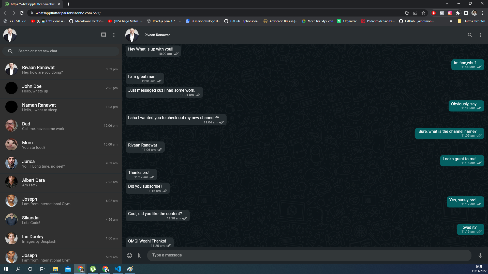
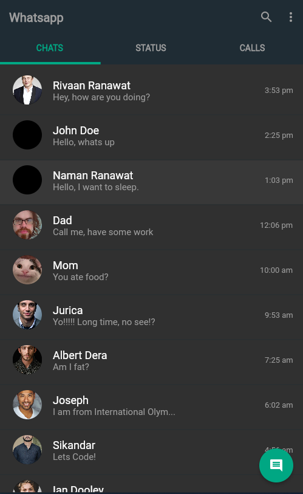

## About
This project is a Whatszap screens clone responsive for web and mobile:

[Web Version Demo](https://whatsappflutter.paulobissonho.com.br)

- Flutter has two rendering modes for web, Canvaskit and HTML renderer, which uses Skia and webassembly, but adds an extra 2MB, not recommended for mobile. The project was compiled using the "Auto" mode, which generates both versions and is adapted for each platform. Desktop uses Canvaskit and mobile uses Html HTML renderer

## Responsive UI

- Web Interface

  

- Mobile interface

  

